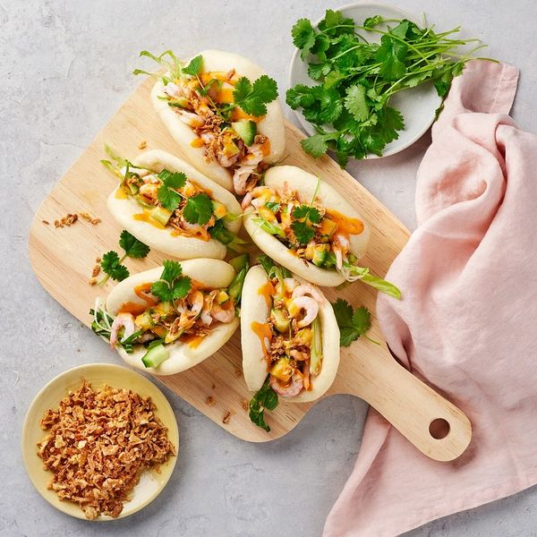

# Bao buns med räkor

*huvudrät, skaldjur, kina*

**4 portioner**

---

## Ingredienser

- 1 förp handskalade räkor i lake (à 580 g)
- 1 gurka
- 1 vitlöksklyfta
- 2 salladslökar
- 1 msk sesamolja
- 1 lime (1 lime motsvarar 1 msk saft)
- salt
- svartpeppar
- 1 hjärtsalladshuvud
- 12 st steam buns bröd
- 1 dl rostad lök
- 1 1/2 dl chilimajonnäs
- 1 kruka koriander

---

## Instruktion

1. Häll av räkorna i en sil
2. Dela gurkan och skrapa bort kärnorna, skär i 1/2 cm stora tärningar.
3. Skala och riv vitlöksklyftan.
4. Ansa och skiva salladslöken fint på snedden.
5. Blanda gurka, vitlök, salladslök och räkor med sesamolja och limesaft.
6. Smaksätt med salt och peppar.

Till servering: Ansa och strimla salladen.

Tillaga steam buns enligt anvisningen på förpackningen.

Fyll steam buns med hjärtsallad och räksallad, toppa med rostad lök, chipotle chili mayo och koriander.
