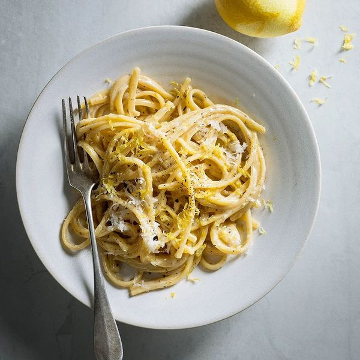

# Citronpasta

*huvudrätt, pasta, enkelt, vegetaris, italian*

**4 portioner**

---

## Ingredienser

- **25 g** smör
- **1** riven vitlöksklyfta
- **2 dl** vispgrädde
- **2 msk** finrivet citronskal (+ ev extra till servering)
- **1 msk** färskpressad citronjuice
- **400 g** pasta (gärna linguine)
- **1 dl** riven parmesan
- krossad svartpeppar
- salt

---

## Instruktion
1. Bryn smöret i en stekpanna. Tillsätt vitlöken och fräs någon minut.
2. Häll ner grädden, citronskal och -juice och låt koka upp.
3. Smaka av med salt.
4. Koka pastan al dente. Häll av vattnet men spara ca 1 dl av pastavattnet
5. Vänd ner pastan, pastavattnet och hälften av parmesanen i såsen och rör till en krämig pasta på medelvärme.
6. Lägg upp och toppa med resten av parmesanen, svartpeppar och gärna extra citronskal.
