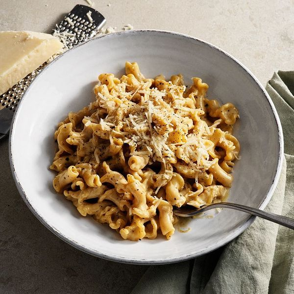

# Smörig pasta med miso

*huvudrätt, pasta, enkelt, vegetarisk*

**4 portioner**

---

## Ingredienser

- 500 g pasta (gärna campanelle)
- 2 rivna vitlöksklyftor
- 2 tsk mortlad svartpeppar
- 2 msk misopasta
- 50 g smör
- 2 1/2 dl vispgrädde
- 1 msk finrivet citronskal
- 2 msk färskpressad citronjuice
- 1 dl riven parmesan
- flingsalt

---

## Instruktioner

1. Koka pastan al dente. Häll av och spar 1-2 dl av pastavattnet
2. Fräs vitlök, svartpeppar och miso i smöret några minuter.
3. Tillsätt grädde, citronskal och -juice och låt koka några minuter.
4. Tillsätt pasta och 1 dl pastavatten (för 4 port) och låt koka ihop
5. Späd ev med mer pastavatten.
6. Rör ner hälften av parmesanen och smaka av med flingsalt.
