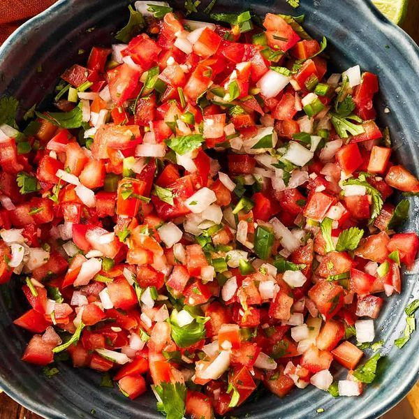

# Pico de Gallo

Pico de Gallo är en populär mexikansk salsa fylld med färska tomater, lök, jalapeño, koriander och limejuice. Pico de Gallo passar utmärkt till tacos, burritos, nachos eller serverad med chips.

*förrätt, tillbehör,mexikanskt, pico de gallo, enkelt*

**6 portioner som förrätt**

---

## Ingredienser

- *450 g* Roma-tomater (3-4 medelstora)
- *0,5* medelstor silverlök (ca 2,5 dl hackad)
- *1* jalapeño, urkärnad och finhack
- *1,2 dl* hackad koriander
- *2 msk* limejuice
- *1/2 tsk* salt eller efter smak
- *1/4* svartpeppar

---

## Instruktion

1. Tärna tomaterna fint
2. Hacka lök, jalapeno och koriander
3. Blanda allt i en medelstor skål

---

## Receptanteckningar
Klarar sig 2 dagar i kylskål.
